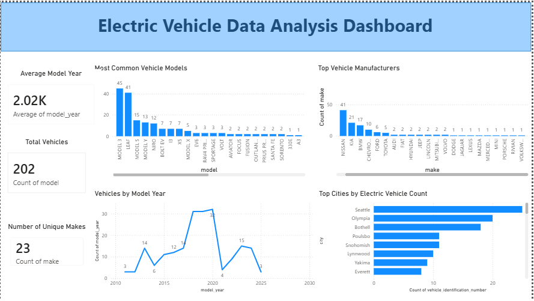

# 🚗 Electric Vehicle Data Analysis

## 📌 Project Overview
This project focuses on analyzing electric vehicle (EV) data using descriptive statistics and data visualization techniques. The main objective is to identify trends and patterns in electric vehicle usage, including the most common manufacturers, popular vehicle models, and the distribution of vehicle model years.

Power BI was used to build an interactive dashboard that visually presents the findings through KPI cards and charts, making insights easier to understand and interpret.

## 📂 Dataset Summary
The dataset contains 203 rows and 6 columns related to electric vehicles (EVs). It includes important information such as:

- Vehicle Identification Number (VIN)
- City
- Model Year
- Manufacturer (Make)
- Vehicle Model

Several missing and inconsistent values were identified during preprocessing. Numerical missing values were replaced using the median, while categorical missing values were handled using the mode or `"Unknown"` to improve data consistency and ensure more accurate analysis.

## 🐍 Exploratory Data Analysis Using Python

The Exploratory Data Analysis (EDA) process was conducted using Python for data preparation, cleaning, and analysis.

### Data Loading
- Imported the dataset using the Pandas library.

### Initial Exploration
- Used functions such as `df.info()` and `describe()` to examine the dataset structure and data types.

### Missing Data Handling
- Identified missing values using `isnull().sum()`.
- Replaced missing values in the `Model Year` column using the median.
- Filled missing categorical values in `City`, `Make`, `Model`, and `VIN` using the mode or `"Unknown"`.

### Descriptive Analysis
- Applied functions such as `value_counts()` and `describe()` to analyze distributions and trends.
- Used Power BI visualizations including bar charts, line charts, and KPI cards to present findings clearly.

## 📊 Key Insights

### Key Insight 1
Tesla is the most dominant vehicle manufacturer in the dataset, while Model 3 is the most frequently occurring vehicle model. This indicates Tesla’s strong market presence and high consumer preference for its electric vehicles.

**Implication:**  
The popularity of Tesla suggests that consumers highly value advanced technology, vehicle performance, and brand reputation when choosing electric vehicles.

**Business Recommendation:**  
Other EV manufacturers should invest more in innovation, battery technology, and smart vehicle features to improve competitiveness and attract more customers.

### Key Insight 2
Most vehicles in the dataset were manufactured between 2018 and 2025, with an average model year of approximately 2018.6. This shows that the dataset mainly contains modern electric vehicles rather than older models.

**Implication:**  
The increasing number of newer EV models reflects growing consumer demand for environmentally friendly transportation and modern vehicle technology.

**Business Recommendation:**  
Businesses and governments should continue expanding charging infrastructure and supporting EV technology development to encourage future growth in the electric vehicle market.

## 📈 Dashboard in Power BI
An interactive dashboard was created in Power BI to visualize important trends and insights related to electric vehicles.

## 🛠 Tools & Technologies
- Python
- Pandas
- NumPy
- Power BI
- Jupyter Notebook

## 👩‍💻 Author
Nguyen Thi Anh Tuyet  
Eastern International University

